# GRUB Theme Manager

A simple Bash script to install and switch between multiple GRUB themes
---

## Features

* Automatically updates GRUB config
* Removes old `GRUB_THEME` entries before adding new one
* Creates backup of `/etc/default/grub`
* Switch between multiple themes by running install.sh script
---

## Available Themes

1. Ashveil
2. BigSur
3. bsol
4. Cyberpunk
5. CyberRe
6. dedsec
7. fallout-grub
8. grub-of-tsushima
9. kawaii-grub
10. Mechanics_grub
11. minegrub
12. redbluepill
13. Sekiro
14. terminator
15. whitesur
16. Yotsuba
17. blur-grub2
18. CartoonGirl
19. crt-amber
20. CyberpunkGRUB
21. Doraemon
22. fedora
23. hp
24. hp-victus
25. Inoue-Takina
26. Kobo-Kanaeru
27. Monika-Version
28. pentract
29. poly-dark-master
30. poly-light-master
31. SAO
32. SekiroShadow
33. Tela
34. Vimix
35. Xenlism-Fedora


---

## Installation

Clone the repository:

```bash
git clone https://github.com/kartikbhati011/Grub-theme-manager.git
cd Grub-theme-manager
```

Make script executable:

```bash
chmod +x install.sh

```

Run script:

```bash
sudo ./install.sh

```

---

## How to add extra themes

1. Add exact folder name in THEMES LIST anywhere
2. Add +1 (35 to 36) in SHOW MENU and VALIDATION. that's it

# Some Previews

## Ashveil
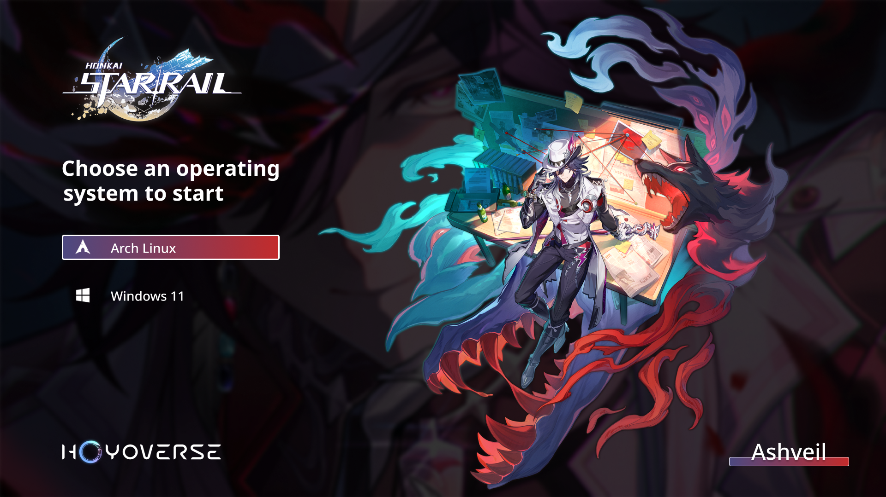

## CartoonGirl
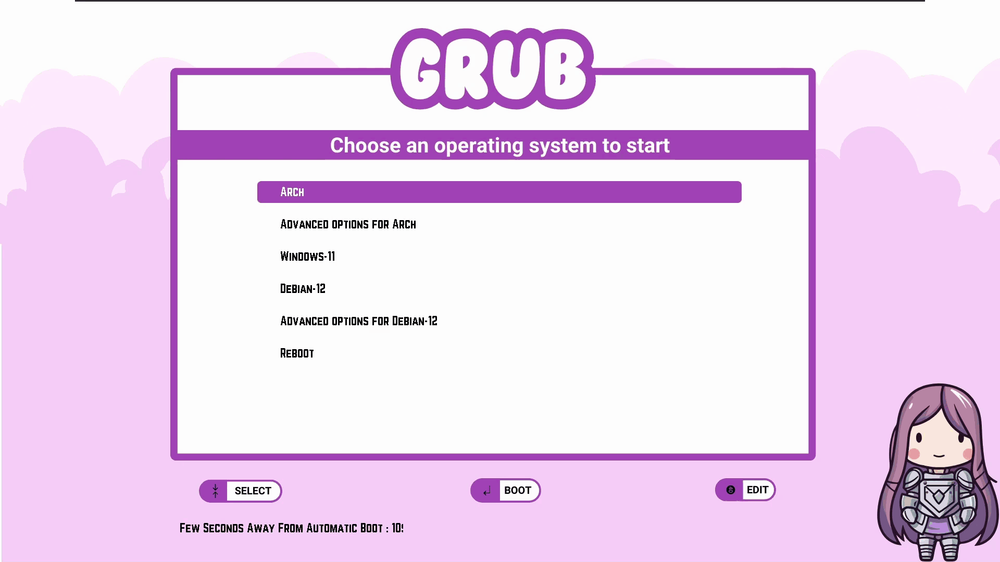

## Doremon
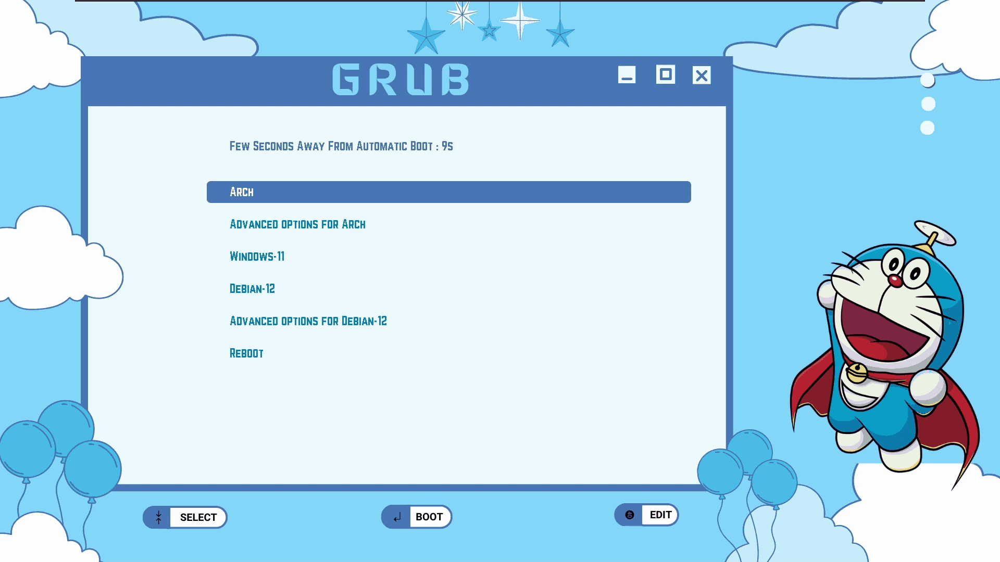

## SekiroShadow

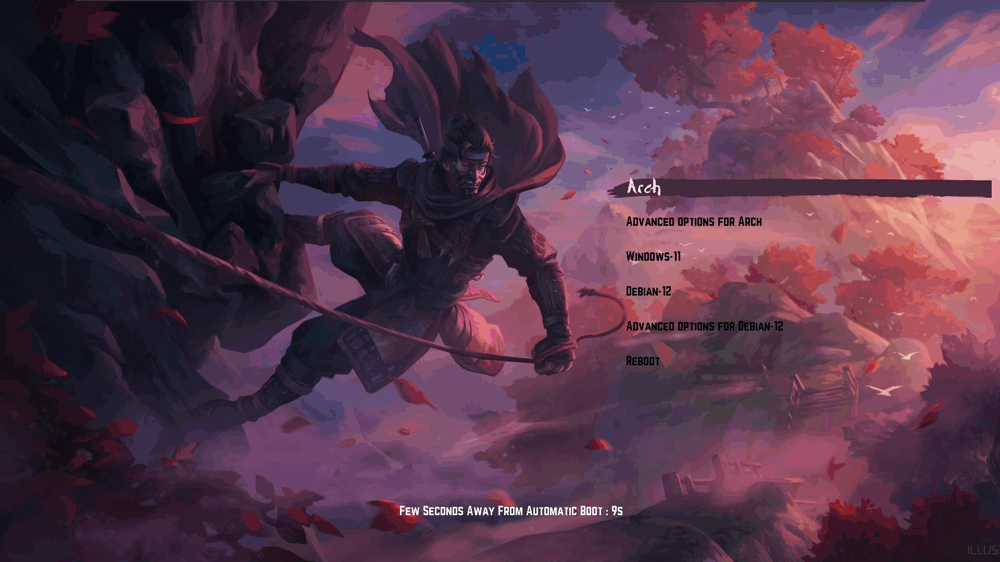

## dedsec

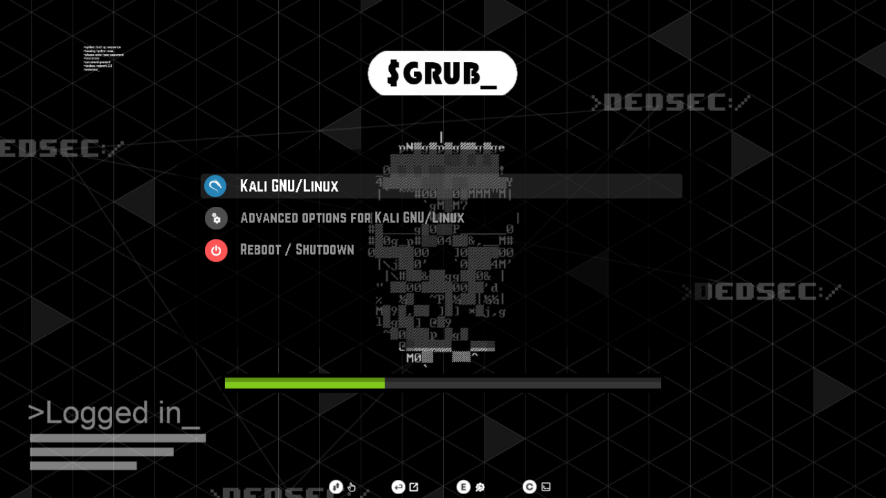

## fallout

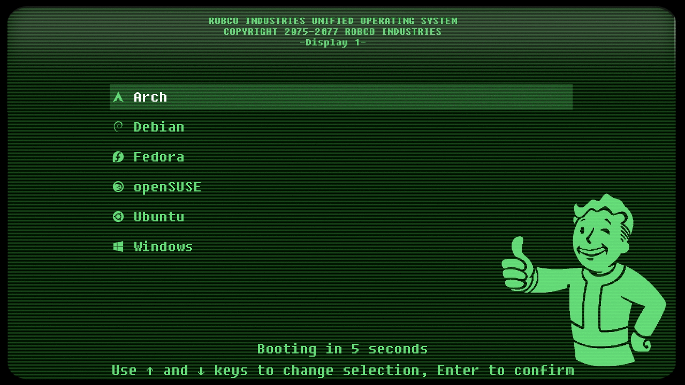

## Cyberpunk


## CyberpunkGRUB

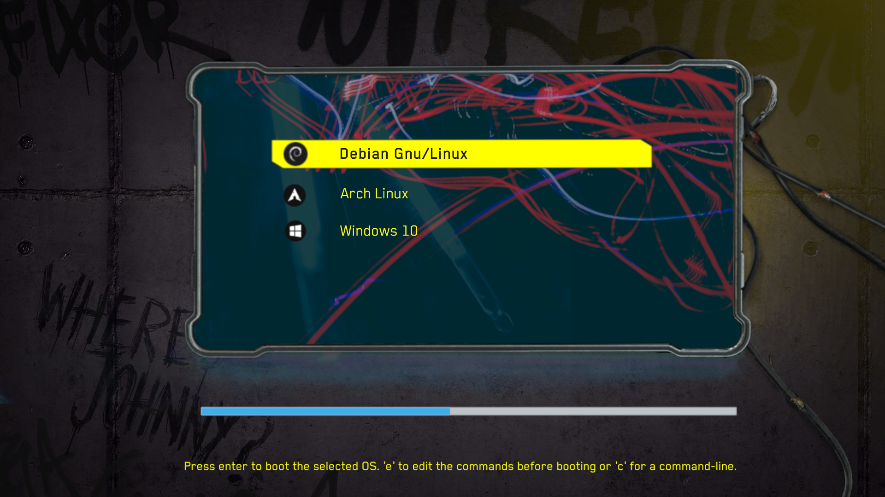

## Tela

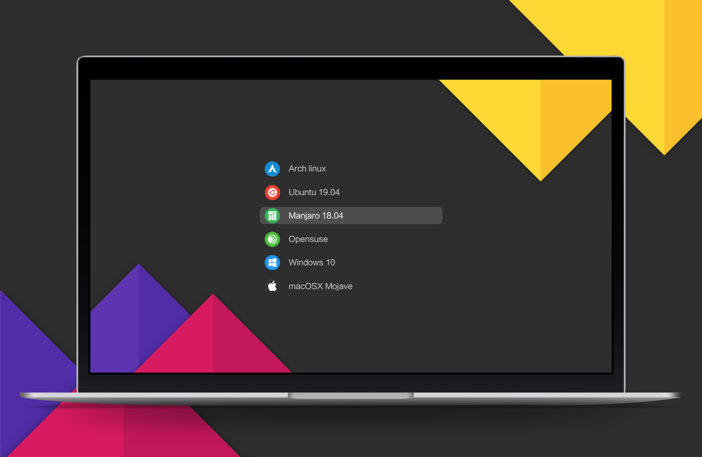

## vimix

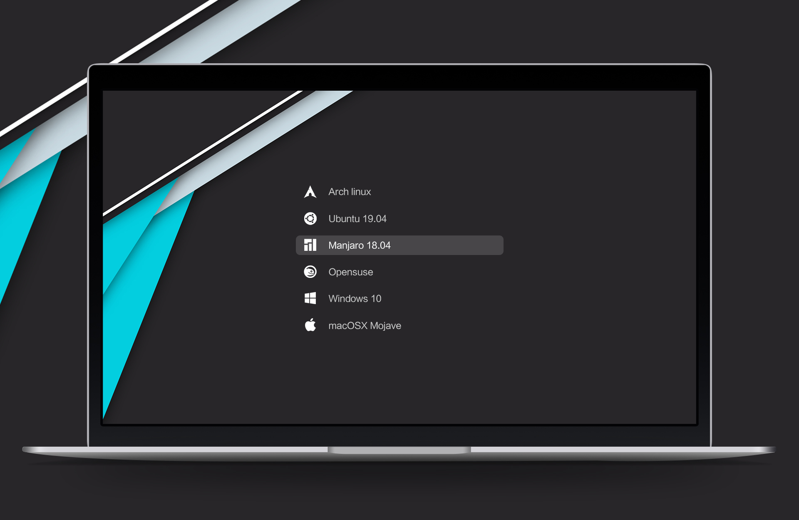

## yotsuba

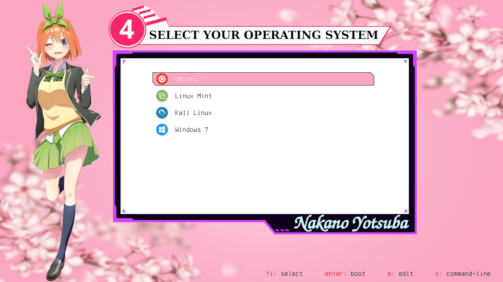

## BigSur

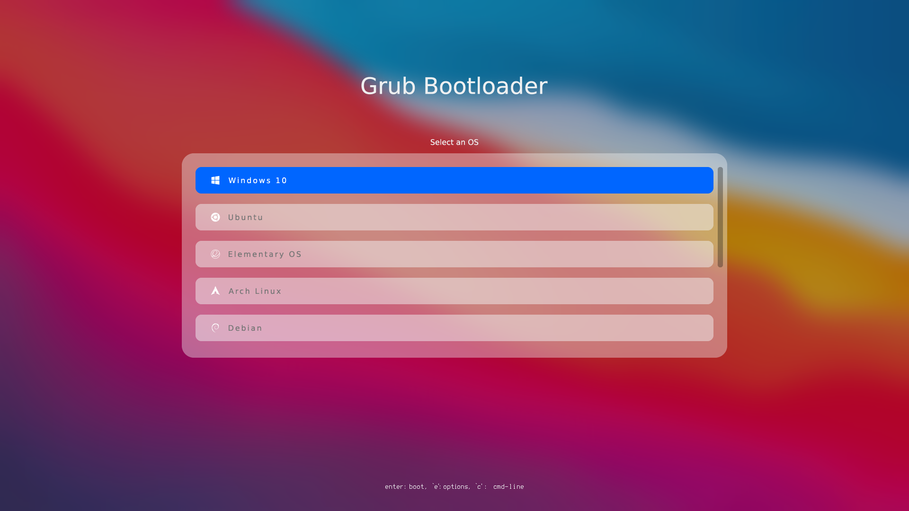

## SAO

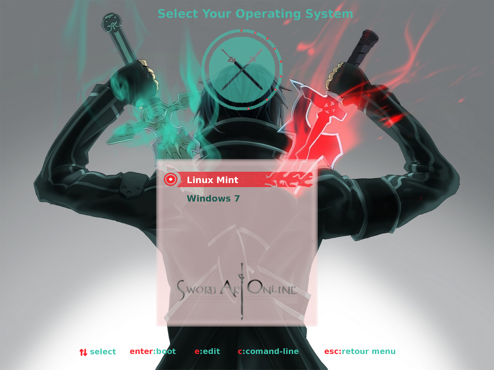

## Poly-light

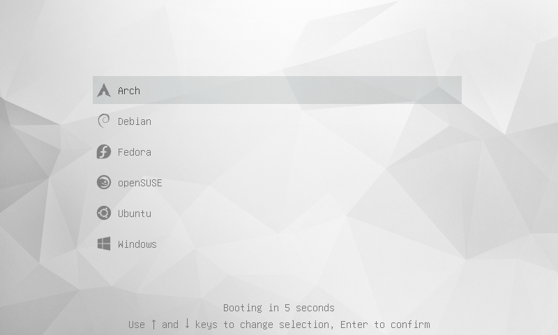

## CyberRe

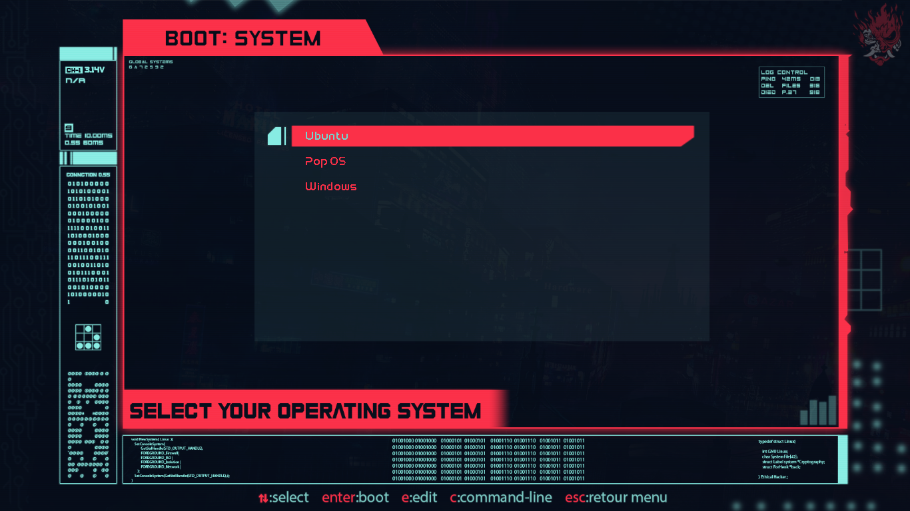

---

## Credits

All GRUB themes included in this repository belong to their respective creators and maintainers.

I do not own these themes.
This repository only provides an easy way to manage and install them using a single interactive script.

## License

This repository only contains the management script.
Individual themes may have their own licenses and copyrights belonging to their original authors.
